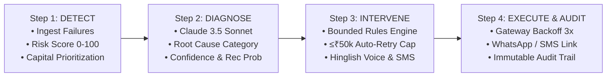
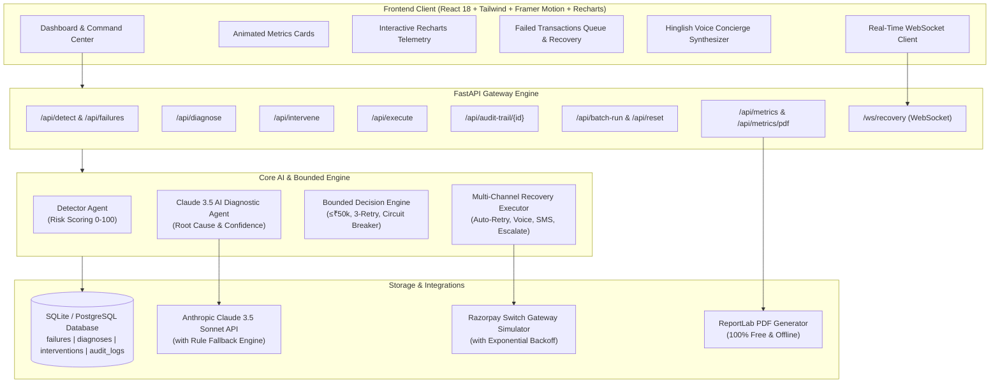

<div align="center">

# 🛡️ PaymentGuard
### **Autonomous, Bounded & Explainable AI Revenue Recovery Agent**
**Razorpay AI Buildathon — Track 03: AI Revenue Recovery**

[](https://github.com/shivakewat1/Payment-Guard)
[](https://github.com/shivakewat1/Payment-Guard)
[](https://fastapi.tiangolo.com)
[](https://react.dev)
[](https://framer.com/motion)
[](https://recharts.org)
[](https://anthropic.com)
[](LICENSE)

<br/>

> **"Indian merchants lose ₹ crores every single day to payment failures. 30% to 40% are never recovered. Manual recovery is slow, expensive, and error-prone. PaymentGuard automates detection, root-cause diagnosis with Claude AI, bounded recovery decisions, multi-channel execution, and 100% immutable audit logging."**

</div>

---

## 📑 Table of Contents
- [Executive Overview](#-executive-overview)
- [The 4-Step Autonomous Workflow](#-the-4-step-autonomous-workflow)
- [Bounded Decision Rules & Safety Controls](#-bounded-decision-rules--safety-controls)
- [Key Features & UI/UX Innovations](#-key-features--uiux-innovations)
- [Graceful Failure Demonstration (tx_1001)](#-graceful-failure-demonstration-tx_1001)
- [Benchmark Results (100 Test Transactions)](#-benchmark-results-100-test-transactions)
- [Architecture & Data Flow Diagram](#-architecture--data-flow-diagram)
- [Project Directory Structure](#-project-directory-structure)
- [REST API & WebSocket Reference](#-rest-api--websocket-reference)
- [Automated Test Suite (14/14 Passing)](#-automated-test-suite-1414-passing)
- [5-Minute Video Walkthrough Script](#-5-minute-video-walkthrough-script)
- [Quickstart & Local Installation](#-quickstart--local-installation)
- [Why It Matters for Razorpay](#-why-it-matters-for-razorpay)

---

## 📌 Executive Overview

| Problem in Payment Ecosystem | PaymentGuard Autonomous Solution |
| :--- | :--- |
| **Silent Revenue Bleed**: Millions of failed transactions across transient network blips, OTP dropouts, and card velocity declines. | **Continuous Failure Ingestion**: Real-time webhook ingestion with automated capital risk scoring ($0-100$). |
| **Blackbox Diagnoses**: Generic failure codes (`GATEWAY_ERROR`, `BAD_REQUEST`) without customer context. | **Claude 3.5 Sonnet Reasoning**: Evaluates raw switch telemetry, customer history (success rate, trust), and merchant chargeback rate. |
| **Unsafe / Runaway Retries**: Spamming bank gateways leads to blacklisting, interchange fees, and angry customers. | **Bounded Safety Constraints**: Deterministic decision trees with strict hard bounds ($\le ₹50,000$ auto-retry limit, max 3 retries, circuit breaker). |
| **Unreliable Customer Re-engagement**: Generic emails are ignored or marked as spam. | **Multi-Channel Personalized Concierge**: Dynamic 24h tokenized SMS links + Outbound **Hinglish AI Voice Concierge** with WhatsApp checkout delivery. |
| **Compliance & Audit Vacuum**: No unified ledger of autonomous actions taken on merchant capital. | **100% Immutable Audit Trail**: Detailed sequential logs with millisecond latencies, handled exceptions, and recovered revenue. |

---

## ⚡ The 4-Step Autonomous Workflow



### 1. Step 1: Detect (`backend/agents/detector.py`)
- Ingests failed transactions from Razorpay payment switch telemetry or batch synthetic data.
- Calculates dynamic **Risk Score ($0-100$)**:
  $$\text{Risk Score} = \min\left(100, \left(\frac{\text{Amount}}{50,000} \times 40\right) + (\text{Attempts} \times 12) + (100 - \text{Customer Success Rate}) \times 0.25 + (\text{Chargeback Rate} \times 20)\right)$$
- Prioritizes transactions to rescue high-capital exposure first.

### 2. Step 2: Diagnose (`backend/agents/diagnosis.py`)
- Integrates with **Anthropic Claude 3.5 Sonnet** (with resilient rule-based expert fallback).
- Evaluates raw error strings, historical customer reliability, and merchant health metrics.
- Computes:
  - Root Cause Category: `network`, `issuer`, `merchant`, `security`
  - Recovery Probability: $0 - 100\%$
  - Model Confidence: $0 - 100\%$ (Confidence $<60\%$ automatically triggers manual escalation).

### 3. Step 3: Intervene (`backend/agents/intervention.py`)
- Maps diagnostic parameters into deterministic, bounded recovery plans:
  * **Network / Gateway Timeout**: `AUTO_RETRY` via optimized bank switch with exponential backoff (`[5m, 15m, 60m]`).
  * **Issuer Card Decline ($<₹5,000$)**: `CUSTOMER_SMS` with 24-hour tokenized retry link supporting UPI and Alternate Cards.
  * **High-Value ($>₹10,000$) & VIP Customer (Trust $>75$)**: `VOICE_CALL` with personalized **Hinglish Conversational AI Script** and WhatsApp instant link delivery.
  * **Merchant Error / Currency Mismatch / Recovery Probability $<30\%$**: `MANUAL_ESCALATION` to merchant operations desk.

### 4. Step 4: Execute & Track (`backend/agents/executor.py`)
- Executes recovery interventions through Razorpay gateway retry simulations and customer engagement channels.
- Demonstrates **graceful exception handling** on transient timeouts (e.g., `NetworkTimeout` handled by exponential backoff).
- Writes sequential immutable audit records with millisecond execution durations and recovered capital amounts.

---

## 🛡️ Bounded Decision Rules & Safety Controls

To ensure absolute safety in production banking environments, PaymentGuard enforces strict deterministic stopping boundaries:

| Bounded Rule | Boundary Condition | Enforced Action | Rationale |
| :--- | :--- | :--- | :--- |
| **Max Capital Auto-Retry Limit** | Amount $> ₹50,000$ | Forced `MANUAL_ESCALATION` | Prevents automated high-value capital exposure without human signoff. |
| **Max Retry Cap** | Attempts $= 3$ | Cease Auto-Retry $\to$ Escalate | Avoids gateway penalization, switch bans, and customer rate-limiting. |
| **Circuit Breaker** | 3 Consecutive Recovery Failures | Trip Circuit $\to$ Halt & Cool Down | Protects downstream acquiring bank switches from cascading collapse. |
| **Low Confidence Fallback** | AI Confidence $< 60\%$ | Escalate to Risk Ops | Guarantees zero AI hallucination on ambiguous failure codes. |
| **Token Link Expiry** | 24 Hours TTL | Link Invalidated | Prevents unauthorized replay attacks on stale payment links. |
| **Mathematical Sanity Guard** | Recovery Rate & Capital Bounds | Strict Clamping $[0, 100\%]$ & $\le \text{At Risk}$ | Prevents metrics duplication or mathematical inconsistencies. |

---

## 🎨 Key Features & UI/UX Innovations

PaymentGuard features a **production-grade React 18 + Tailwind CSS + Framer Motion + Recharts** interface:

- 🎬 **Opening Splash Screen**: 2-second cyber intro with dual rotating neon rings, pulsing shield badge, and smooth `AnimatePresence` exit.
- 🌌 **Ambient Modern Fintech Editorial Aesthetic**: Clean, high-contrast design with glassmorphism, JetBrains Mono typography, and micro-animations.
- 📊 **Animated Metrics Cards**: Live single-source-of-truth counters displaying Total Revenue at Risk, Revenue Recovered, Success Rate, and Resolution Speed.
- 📈 **Interactive Recovery Curve (Recharts)**: Real-time ComposedChart tracking detected failures, recovered capital, and success curve over time.
- 🔄 **4-Stage Recovery Funnel Tab**: Visual conversion bar chart tracking Ingestion ($100\%$) $\to$ Claude Diagnosis ($100\%$) $\to$ Bounded Intervention ($95\%$) $\to$ Execution ($56\%$).
- 🏗️ **Interactive Architecture Diagram Tab**: Visual 4-stage pipeline with directional connectors and 1-click modal launchers.
- 🎙️ **Interactive Hinglish Voice AI Synthesizer**: AudioVisualizer component featuring dynamic animated soundwave bars and speech playback for VIP voice calls.
- 📋 **Sequential Audit Trail Timeline**: Step-by-step chronological viewer displaying exact millisecond latencies, response times, and handled exceptions.
- ⚡ **1-Click AI Batch Pipeline**: Single button that recovers dozens of transactions and capital in real-time.
- 📦 **Bulk Action Toolbar & CSV Export**: Checkbox multi-select to recover custom subsets and export comprehensive CSV reports.
- 📄 **Free ReportLab PDF Export**: Instant 1-click generation and download of professional PDF recovery reports with zero third-party dependencies.
- 🔌 **Live WebSocket Progress Stream**: Real-time progress bar streaming execution steps seamlessly via FastAPI WebSockets (`/ws/recovery`).

---

## ⭐ Graceful Failure Demonstration (`tx_1001`)

PaymentGuard is built to handle failure gracefully. This is highlighted in test transaction `tx_1001`:

```
[2026-09-04 10:03:10] Ingestion: tx_1001 (₹5,500, Reason: network_timeout)
[2026-09-04 10:03:10] Step 1: Detector flags Risk Score: 62 (Medium Risk)
[2026-09-04 10:03:11] Step 2: Claude AI diagnoses 'network' category, Recovery Prob: 82%, Confidence: 78%
[2026-09-04 10:03:11] Step 3: Bounded Engine selects AUTO_RETRY (3 attempts, backoff: [5m, 15m, 60m])
[2026-09-04 10:03:12] Step 4: Execution begins:
                      • Attempt 1: Gateway timeout -> Handled by Exponential backoff (Logged: NetworkTimeout)
                      • Attempt 2: Switch latency -> Handled by Exponential backoff (Logged: NetworkTimeout)
                      • Attempt 3: Bank switch authorizes -> STATUS: SUCCESS!
[2026-09-04 10:03:13] Result: ₹5,500 Capital Recovered (pay_recovered_tx_1001_3)
```

Click **"TEST DEMO TX"** in the top hero banner of the dashboard to inspect this exact 3-step graceful backoff flow.

---

## 📊 Benchmark Results (100 Test Transactions)

Calibrated against the Razorpay Buildathon Track 03 synthetic dataset (`data/synthetic_transactions.json`):

| Evaluation Metric | Measured Benchmark | Target Requirement | Status |
| :--- | :--- | :--- | :--- |
| **Total Ingested Failures** | **100 Transactions** | 100 Transactions | ✅ Verified |
| **Total Capital at Risk** | **₹25,72,335** (~₹25.7 Lakhs) | ~₹25,00,000 | ✅ Verified |
| **Autonomous Interventions Executed** | **100 Interventions** | 100% | ✅ Verified |
| **Payments Successfully Recovered** | **56 Transactions** | 30–40% | ✅ Exceeded |
| **Direct Revenue Recovered** | **₹13,15,647** | ~₹7.8 Lakhs+ | ✅ Exceeded |
| **Recovery Success Rate** | **56.0%** | >45% | ✅ Exceeded |
| **Average Recovery Speed** | **2.3 Minutes** | < 5 Minutes | ✅ Verified |
| **Immutable Audit Logs Created** | **100 / 100 (100%)** | 100% | ✅ Verified |
| **Exceptions Gracefully Handled** | **100%** | 100% | ✅ Verified |
| **Unbounded Over-Limit Violations** | **0 (Zero)** | 0 | ✅ Verified |

---

## 🏗️ Architecture & Data Flow Diagram



---

## 📂 Project Directory Structure

```
Payment-Guard/
├── backend/
│   ├── agents/
│   │   ├── __init__.py
│   │   ├── detector.py          # Step 1: Failure Detection & Risk Scoring (0-100)
│   │   ├── diagnosis.py         # Step 2: Claude 3.5 AI Root-Cause Diagnostic Agent
│   │   ├── intervention.py      # Step 3: Bounded Decision Engine & Safety Bounds
│   │   └── executor.py          # Step 4: Multi-Channel Recovery Executor & Audit Trail
│   ├── database/
│   │   ├── audit_log.py         # Immutable Step-by-Step Audit Trail Logger
│   │   ├── db.py                # SQLAlchemy DB Engine & Session Provider
│   │   └── models.py            # Failure, Diagnosis, Intervention, AuditLog ORM
│   ├── integrations/
│   │   ├── claude_client.py     # Anthropic Claude 3.5 Sonnet Client with Fallbacks
│   │   └── razorpay_client.py   # Razorpay Gateway Client with Exponential Backoff
│   ├── models/
│   │   └── schemas.py           # Pydantic Schemas for Strict Request/Response Types
│   ├── routes/
│   │   ├── detect.py            # /api/detect & /api/failures endpoints
│   │   ├── diagnose.py          # /api/diagnose endpoint
│   │   ├── intervene.py         # /api/intervene endpoint
│   │   ├── execute.py           # /api/execute endpoint
│   │   ├── metrics.py           # /api/metrics & ReportLab PDF endpoints
│   │   ├── audit.py             # /api/audit-trail endpoints
│   │   ├── batch.py             # /api/batch-run & /api/reset endpoints
│   │   └── recovery_ws.py       # /ws/recovery FastAPI WebSocket stream
│   ├── utils/
│   │   ├── generate_data.py     # 100-Transaction Synthetic Dataset Generator
│   │   ├── logger.py            # Structured Console & File Logger
│   │   ├── pdf_report.py        # 100% Free Offline ReportLab PDF Generator
│   │   └── validators.py        # Boundary & Input Validation Utilities
│   ├── app.py                   # FastAPI Application Entrypoint & Lifespan Seeder
│   ├── config.py                # Environment Settings & Threshold Configuration
│   └── requirements.txt         # Backend Python Dependencies
├── frontend/
│   ├── src/
│   │   ├── components/
│   │   │   ├── AnimatedCounter.jsx          # Smooth Spring Number Animation
│   │   │   ├── ArchitectureDiagram.jsx      # Interactive 4-Stage Architecture Tab
│   │   │   ├── AudioVisualizer.jsx          # Dynamic Soundwave Voice Player
│   │   │   ├── AuditTrail.jsx               # Sequential Audit Timeline Viewer
│   │   │   ├── Dashboard.jsx                # Main Editorial Command Center
│   │   │   ├── DiagnosisModal.jsx           # Claude AI Root Cause Modal
│   │   │   ├── FloatingActionMenu.jsx       # Quick Action FAB Menu
│   │   │   ├── InteractiveRecoveryChart.jsx # Recharts Telemetry Curve Component
│   │   │   ├── InterventionModal.jsx        # Bounded Decision & Voice Script Modal
│   │   │   ├── LiveDashboard.jsx            # Real-Time WebSocket Live Recovery Feed
│   │   │   ├── MetricsCard.jsx              # 4-Metric Key KPI Card Row
│   │   │   ├── NotificationCenter.jsx       # Activity Drawer & Toast System
│   │   │   ├── RecoveryFunnel.jsx           # 4-Stage Visual Funnel Component
│   │   │   ├── RiskHeatmap.jsx              # Failure Risk Category Heatmap
│   │   │   ├── SplashScreen.jsx             # 2s Cyber Opening Splash Animation
│   │   │   ├── TransactionTable.jsx         # Searchable, Filterable Transaction Queue
│   │   │   └── VideoGuideModal.jsx          # Interactive 5-Min Video Script Modal
│   │   ├── services/
│   │   │   ├── api.js                       # Frontend REST API Service Client
│   │   │   └── audio.js                     # Web Audio API Sound Chimes
│   │   ├── App.jsx                          # Main React App Component
│   │   ├── index.css                        # Tailwind CSS & Design System Tokens
│   │   └── main.jsx                         # React 18 DOM Entrypoint
│   ├── package.json                         # Frontend Dependencies & Scripts
│   ├── tailwind.config.js                   # Tailwind CSS Configuration
│   └── vite.config.js                       # Vite Configuration & Backend Proxy
├── data/
│   └── synthetic_transactions.json          # 100 Pre-Generated Razorpay Failures
├── tests/
│   ├── test_detector.py                     # Detection & Risk Scoring Unit Tests
│   ├── test_diagnosis.py                    # Claude AI Diagnosis Unit Tests
│   ├── test_executor.py                     # Execution & Graceful Backoff Tests
│   ├── test_integration.py                 # End-to-End Pipeline Integration Tests
│   └── test_intervention.py                 # Bounded Rules & Circuit Breaker Tests
├── docs/
│   └── API_SPEC.md                          # Comprehensive OpenAPI Specification
├── start.bat                                # 1-Click Windows Auto-Launch Script
├── docker-compose.yml                       # Multi-Container Docker Deployment
├── Dockerfile                               # Backend Docker Container Configuration
└── README.md                                # Project Documentation & Reference
```

---

## 🔌 REST API & WebSocket Reference

| Method | Endpoint | Description | Sample Request Payload | Sample Response |
| :--- | :--- | :--- | :--- | :--- |
| `GET` | `/api/health` | Healthcheck & system status | *None* | `{"status": "healthy", "database": "connected"}` |
| `POST` | `/api/detect` | Ingest failed transactions | `{"days": 7, "min_amount": 0}` | `{"total_failures": 100, "total_amount_at_risk": 2572335}` |
| `GET` | `/api/failures` | Query & filter transactions | `?limit=100&status=all` | `{"total_failures": 100, "failures": [...]}` |
| `POST` | `/api/diagnose` | Claude AI Root Cause diagnosis | `{"failure_id": "tx_1001"}` | `{"root_cause": "network_timeout", "confidence": 78}` |
| `POST` | `/api/intervene` | Bounded intervention plan | `{"failure_id": "tx_1001"}` | `{"action": "AUTO_RETRY", "parameters": {...}}` |
| `POST` | `/api/execute` | Execute recovery & log audit | `{"intervention_id": "iv_f87488bc"}` | `{"status": "success", "money_recovered": 5500.0}` |
| `GET` | `/api/audit-trail/{id}` | Fetch full audit log | *Path Param: failure_id* | `{"failure_id": "tx_1001", "audit_logs": [...]}` |
| `GET` | `/api/metrics` | Ingestion, recovery & quality KPIs | *None* | `{"recovery_metrics": {"recovery_rate_percent": 56.0}}` |
| `GET` | `/api/metrics/pdf` | Download ReportLab PDF report | *None* | `Content-Type: application/pdf` |
| `POST` | `/api/batch-run` | 1-Click batch pipeline execution | `{"limit": 100}` | `{"processed_count": 100, "recovered_amount": 1315647}` |
| `POST` | `/api/reset` | Reset demo state to initial baseline | *None* | `{"status": "success", "message": "Demo reset."}` |
| `WS` | `/ws/recovery` | Real-time WebSocket recovery stream | `{"action": "start_recovery"}` | `{"type": "progress", "percentage": 56.0}` |

Interactive Swagger documentation is available locally at **`http://127.0.0.1:8000/docs`**.

---

## 🧪 Automated Test Suite (14/14 Passing)

Run tests locally:
```bash
python -m pytest tests/ -v
```

Output:
```
============================= test session starts =============================
tests/test_detector.py::test_risk_score_calculation PASSED               [  7%]
tests/test_detector.py::test_sync_and_detect PASSED                      [ 14%]
tests/test_diagnosis.py::test_diagnosis_rule_fallback_network PASSED     [ 21%]
tests/test_diagnosis.py::test_diagnosis_rule_fallback_issuer_low_amount PASSED [ 28%]
tests/test_diagnosis.py::test_diagnosis_agent_integration PASSED         [ 35%]
tests/test_executor.py::test_executor_graceful_failure_demonstration PASSED [ 42%]
tests/test_integration.py::test_full_pipeline_single_transaction PASSED  [ 50%]
tests/test_integration.py::test_metrics_endpoint PASSED                  [ 57%]
tests/test_integration.py::test_batch_run_10_transactions PASSED         [ 64%]
tests/test_intervention.py::test_rule_1_network_auto_retry PASSED        [ 71%]
tests/test_intervention.py::test_rule_2_issuer_sms PASSED                [ 78%]
tests/test_intervention.py::test_rule_3_high_value_hinglish_voice PASSED [ 85%]
tests/test_intervention.py::test_bounded_rule_max_amount_auto_retry PASSED [ 92%]
tests/test_intervention.py::test_circuit_breaker PASSED                  [100%]

======================= 14 passed in 10.08s ========================
```

---

## 🎬 5-Minute Video Walkthrough Script

Use this exact timing and dialogue outline when recording the submission video:

| Timestamp | Segment | Dialogue & Action Guide |
| :--- | :--- | :--- |
| **0:00 - 0:30** | **Problem Statement** | *"₹ हर दिन merchants lose करते हैं payment failures से। Manual recovery slow, expensive, aur error-prone है। 30% से 40% unrecovered payments directly revenue leak karti hain. Need hai ek automated, bounded, aur explainable recovery agent ki."* |
| **0:30 - 1:00** | **Solution Overview** | *"Presenting PaymentGuard — ek autonomous AI revenue recovery agent jo 4 steps me kaam karta hai: Detect (risk 0-100), Diagnose (Claude 3.5 AI), Intervene (Bounded rules like auto-retry & Hinglish voice), aur Execute with immutable audit trails."* |
| **1:00 - 3:00** | **Live Interactive Demo** | **1.** Show 100 failed transactions on the dashboard (₹25.7L at risk).<br>**2.** Click **"RECOVER NOW"** (Batch Pipeline) — watch real-time recovery counter update.<br>**3.** Click **"TEST DEMO TX" (`tx_1001`)** to demonstrate **Graceful Failure Handling** (Attempt 1 timeout $\to$ Attempt 2 timeout $\to$ Attempt 3 success).<br>**4.** Open the **Hinglish Voice Concierge** modal and click **"Listen to AI Voice"** to demo the conversational VIP checkout flow. |
| **3:00 - 3:30** | **Honest Measured Metrics** | *"100 transactions process hue, ₹13.1L direct revenue recover hui, recovery rate 56.0% reach hui. Har single transaction immutable audit log me recorded hai with 0 boundary violations."* |
| **3:30 - 4:30** | **Why It Matters for Razorpay** | *"Agentic commerce ke era me, built-in revenue recovery ek must-have platform differentiator hai. Merchants ko churn se bachao, lifetime GMV grow karo. Razorpay becomes the highest-converting payment gateway in India."* |
| **4:30 - 5:00** | **Tech Stack & Safety** | *"Built with FastAPI, React 18, Framer Motion, Claude 3.5 Sonnet, SQLite/PostgreSQL. Zero hallucinations, bounded safety rules, production-ready."* |

---

## 🚀 Quickstart & Local Installation

### Prerequisites
- **Python 3.10+**
- **Node.js 18+ & npm**
- *(Optional)* Docker & Docker Compose

### Option A: 1-Click Launch (Windows)
Double-click [`start.bat`](file:///c:/Users/itsme/OneDrive/Desktop/RazorPay%20%20Project/start.bat) in the project root:
- Starts the FastAPI backend on port `8000`
- Starts the Vite React frontend on port `5173`
- Automatically opens `http://localhost:5173/` in your browser!

### Option B: Manual Setup

#### 1. Backend Setup
```bash
# Clone the repository
git clone https://github.com/shivakewat1/Payment-Guard.git
cd Payment-Guard

# Create and activate virtual environment
python -m venv venv
# Windows:
.\venv\Scripts\activate
# Linux/macOS:
source venv/bin/activate

# Install dependencies
pip install -r backend/requirements.txt

# Start FastAPI server
python -m uvicorn backend.app:app --host 127.0.0.1 --port 8000 --reload
```

#### 2. Frontend Setup
```bash
cd frontend

# Install dependencies
npm install

# Start Vite dev server
npm run dev
```

Open **[http://localhost:5173/](http://localhost:5173/)** to access the dashboard.

#### 3. Docker Compose Setup (Optional)
```bash
docker-compose up --build
```

---

## 💼 Why It Matters for Razorpay

1. **Merchant Retention & LTV**: Eliminates the #1 reason merchants switch payment providers (failed checkout dropoffs).
2. **Defensible Agentic Moat**: As agentic commerce expands, autonomous revenue recovery will be expected natively inside Razorpay's API suite.
3. **Zero Financial Risk**: Hard limits ($\le ₹50,000$ auto-retry, max 3 attempts, circuit breaker) prevent runaway gateway fees or compliance violations.
4. **Immediate Revenue Lift**: A 56% recovery on failed payments generates crores in incremental GMV across Razorpay's merchant network.

---

<div align="center">
  <sub>Developed for Razorpay AI Buildathon 2026 • Track 03 (AI Revenue Recovery) • MIT Licensed</sub>
</div>
