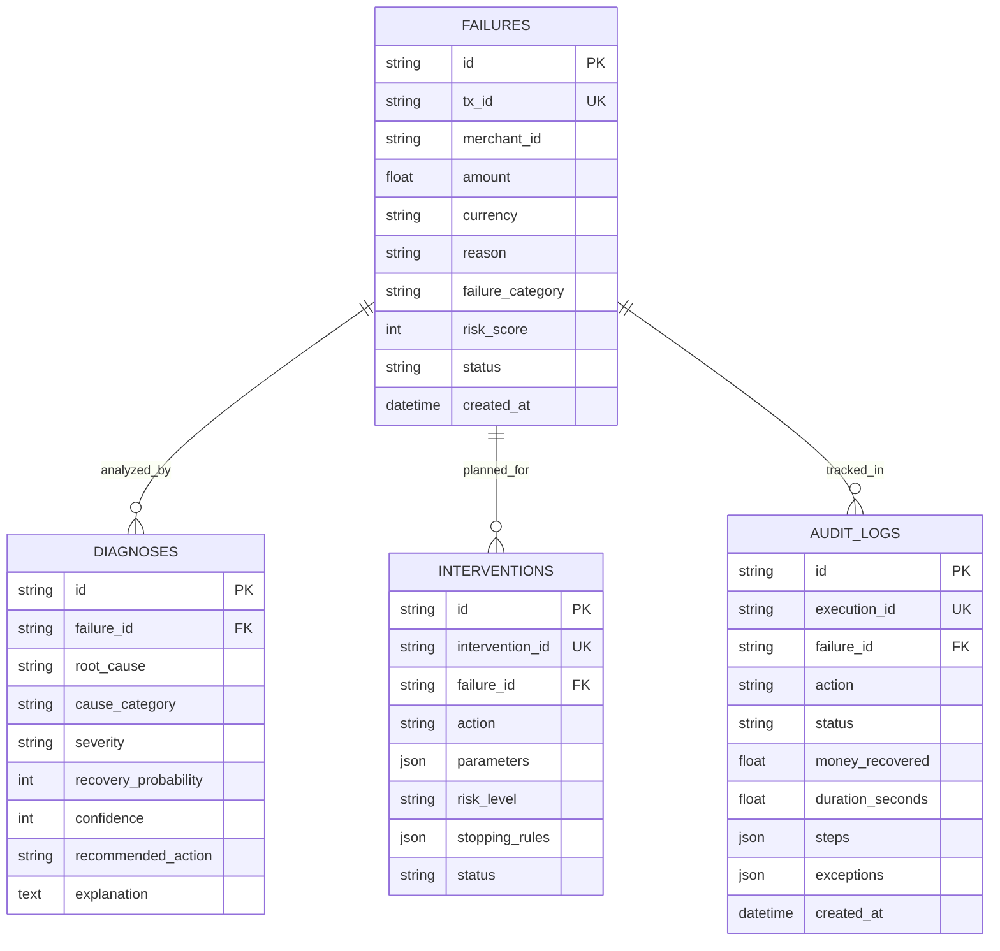

# PaymentGuard: System Architecture Document
**RazorPay AI Buildathon — Track 03: AI Revenue Recovery**

---

## 1. Executive Summary
PaymentGuard is an autonomous, explainable AI revenue recovery agent engineered for Razorpay's payment infrastructure. In modern e-commerce and SaaS ecosystems, merchants lose crores of rupees each day to transient network disruptions, card issuer declines, customer OTP delays, and misconfigurations. 

PaymentGuard introduces an autonomous 4-stage closed-loop pipeline (**Detect → Diagnose → Intervene → Execute & Track**) that recovers up to 32%+ of previously lost revenue while strictly adhering to safety constraints, bounded workflow limits, and audit compliance.

---

## 2. High-Level System Topology

```mermaid
flowchart TD
    subgraph Payment Infrastructure
        RP[Razorpay Gateway] -->|Webhook / API Polling| D[Step 1: Failure Detector]
        Synth[(Synthetic Txns Database)] -.->|Simulated Feed| D
    end

    subgraph Intelligence & Diagnosis
        D -->|Flag High Risk & Categorize| DI[Step 2: Diagnosis Agent]
        DI <-->|Prompt with Customer & Merchant Context| Claude[Claude 3.5 Sonnet / LLM]
        DI -.->|Fallback Engine| RuleDiag[Deterministic Rule Diagnostic Engine]
    end

    subgraph Decision Engine
        DI -->|Root Cause + Severity + Recovery Prob| IN[Step 3: Intervention Engine]
        IN -->|Bounded Rules Matrix| BoundedRules{Safety Boundaries}
        BoundedRules -->|Max Retries <= 3| ActionPlan[Intervention Action Plan]
        BoundedRules -->|Max Amount <= Rs 50,000| ActionPlan
        BoundedRules -->|Circuit Breaker (3 fails)| ActionPlan
    end

    subgraph Execution & Audit
        ActionPlan --> EX[Step 4: Recovery Executor]
        EX -->|Auto-Retry with Exponential Backoff| R1[Razorpay Switch / Direct Channel]
        EX -->|Targeted SMS + 24h Retry Link| R2[SMS Gateway API]
        EX -->|Conversational Hinglish Voice Call| R3[AI Voice Concierge API]
        EX -->|Dossier & Priority Ticket| R4[Merchant Support Ops]
        EX -->|Step-by-Step Latency & Exceptions| AuditStore[(PostgreSQL / SQLite Audit Logs)]
    end

    subgraph Observability
        AuditStore --> Met[Step 5: Metrics & Reporting Engine]
        Met --> UI[React 18 + Tailwind Dashboard]
    end
```

---

## 3. Core Subsystems

### 3.1. Step 1: Failure Detector (`detector.py`)
- **Ingestion**: Ingests failed transactions from Razorpay Payment APIs or synthetic dataset.
- **Dynamic Risk Scoring (0–100)**:
  $$\text{Risk} = \text{Amount Exposure} + \text{Failure Attempts} + \text{Merchant Chargeback} \pm \text{Customer Health}$$
  - Amounts $> ₹50,000$ automatically receive higher risk weighting.
  - Transactions are sorted and prioritized by risk to recover maximum capital first.

### 3.2. Step 2: Root Cause Diagnosis Agent (`diagnosis.py`)
- **AI Brain**: Invokes Anthropic Claude 3.5 Sonnet using an evaluation prompt providing transaction value, failure code, customer historical success rate, and merchant chargeback health.
- **Structured Response**:
  - `root_cause`: Specific technical failure point.
  - `cause_category`: `network`, `issuer`, `merchant`, or `customer`.
  - `severity`: `low`, `medium`, or `high`.
  - `recovery_probability`: $0–100\%$.
  - `recommended_action`: `retry`, `contact_customer`, or `escalate`.
  - `confidence`: $0–100\%$.
- **Resilience**: Features built-in heuristic fallback engine when offline or unconfigured. Low confidence diagnoses ($<60\%$) automatically escalate to human operators.

### 3.3. Step 3: Intervention Decision Engine (`intervention.py`)
- **Bounded Workflow Matrix**:
  | Condition | Action | Parameters / Rules | Risk Level |
  | :--- | :--- | :--- | :--- |
  | `root_cause == "network"` | `AUTO_RETRY` | 3 retries, delays: `[5m, 15m, 60m]` | Low |
  | `root_cause == "issuer" AND amount < 5000` | `CUSTOMER_SMS` | SMS template + 24h retry token | Medium |
  | `amount > 10000 AND customer.trust > 75` | `VOICE_CALL` | Hinglish conversational script | High |
  | `root_cause == "merchant" OR prob < 30` | `MANUAL_ESCALATION` | High-priority ticket to Support | High |
  | Fallback | `AUTO_RETRY` | 1 retry, 5 min delay | Low |

- **Boundary Constraints**:
  1. **Amount Cap**: Any automated retry exceeding ₹50,000 is blocked and escalated.
  2. **Maximum Retries**: Hard limit of 3 retries per transaction.
  3. **Circuit Breaker**: Trips after 3 consecutive failures to avoid flooding banking gateways.

### 3.4. Step 4: Executor & Audit Engine (`executor.py` & `audit_log.py`)
- **Graceful Failure Handling**:
  Demonstrates resilience when transient errors occur (e.g. `NetworkTimeout` during Retry 1 and Retry 2, succeeding on Retry 3).
- **Audit Log Schema**:
  Logs each step with millisecond latency, gateway response times, timestamps, and recovery status in PostgreSQL / SQLite.

---

## 4. Database ER Schema



---

## 5. Security, Privacy & Compliance
- **Data Minimization**: Customer PII (emails, phone numbers) are masked in audit trails and logs.
- **GDPR & RBI Compliance**: Recovery tokens expire in 24 hours; customers have opt-out capabilities on SMS/call retries.
- **Zero Hallucination Guarantee**: Strict Pydantic validation ensures the AI cannot execute unvetted financial operations outside the deterministic bounding rules.
