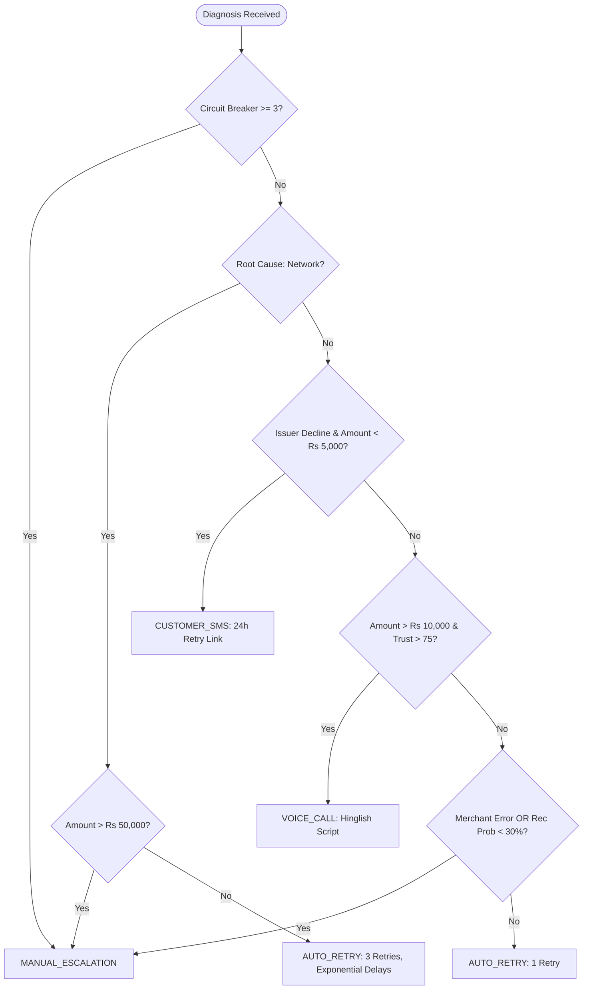

# PaymentGuard: Technical Implementation Guide

This guide explains how PaymentGuard's 4 core agent workflows operate internally, how errors are caught and mitigated gracefully, and how compliance boundaries are enforced.

---

## 1. Feature 1: Failure Detection Engine (`backend/agents/detector.py`)

### Input Specification
```json
{
  "merchant_id": "mer_quickkart_01",
  "days": 7,
  "min_amount": 100,
  "filter_by_type": "all"
}
```

### Risk Calculation Algorithm
The risk score determines priority in the recovery queue.
```python
score = 0.0
# 1. Capital Exposure (0-40)
if amount > 50000: score += 40
elif amount > 25000: score += 30
elif amount > 10000: score += 20
elif amount > 3000: score += 12
else: score += 6

# 2. Velocity / Repeated Attempts (0-30)
score += min(attempts * 12, 30)

# 3. Merchant Risk Profile (0-20)
score += min(chargeback_rate * 25, 20)

# 4. Customer Trust Adjustment (-15 to +15)
if customer_success_rate < 50.0: score += 15
elif customer_success_rate > 90.0: score -= 10

return clamp(score, 5, 100)
```

---

## 2. Feature 2: Claude AI Root Cause Diagnosis (`backend/agents/diagnosis.py`)

PaymentGuard constructs an isolated prompt containing the failure reason code, customer historical authorization rate, and merchant metrics.

```
Analyze this payment failure and provide diagnosis:

Transaction: ₹{amount} failed because {reason}
Customer: {customer_email}, past success rate: {success_rate}%
Merchant: {merchant_name}, chargeback rate: {chargeback_rate}%

Determine:
1. Root cause: "network" OR "issuer" OR "merchant" OR "customer"
2. Severity: "low" OR "medium" OR "high"
3. Recovery probability: 0-100%
4. Recommended action: "retry" OR "contact_customer" OR "escalate"
5. Confidence: 0-100%

Respond in JSON format only.
```

### Fallback Guarantee
If Anthropic API credentials are missing, network connectivity is unavailable, or response parsing fails, the system triggers `_rule_based_fallback()`. If the returned confidence is below $60\%$, the action is escalated to protect merchant security.

---

## 3. Feature 3: Intervention Decision Engine (`backend/agents/intervention.py`)

The decision engine bridges AI diagnosis to deterministic, bounded recovery policies:



---

## 4. Feature 4: Execution & Audit Logging (`backend/agents/executor.py`)

### Graceful Failure Demonstration Walkthrough
When `tx_1001` or transient network timeouts occur, the agent does not abort the transaction:
1. **Attempt 1**: `POST` to switch fails (`GATEWAY_TIMEOUT`).
   - Handler catches error.
   - Logs: `"Network timeout: Bank gateway did not respond within 30000ms - Scheduled exponential backoff delay (5min)"`.
   - Records `AuditLog.exceptions = { "exception_type": "NetworkTimeout", "handled_by": "Exponential backoff" }`.
2. **Attempt 2**: Second retry fails (`GATEWAY_TIMEOUT`).
   - Handler catches error and schedules next delay (15min).
3. **Attempt 3**: Third retry succeeds.
   - Gateway returns `pay_recovered_tx_1001_3`.
   - Money recovered logged: `₹22,500.00`.
   - Audit status marked `success`.
